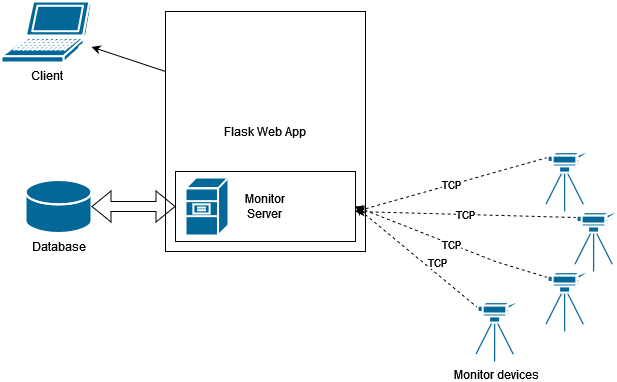

# ForestMonitor

Web application for gathering data from camera monitor devices in the wild.
## Architecture 

## Modules
main_app.py - Main app script

monitor_server.py - TCP Server; Communicates with devices and stores data in database

monitor_client.py - Device Simulation script

dbcontrol.py - Database control utility module

sensor_status.py - Sensor status class utility module

# Requirements

flask

pysqlite3